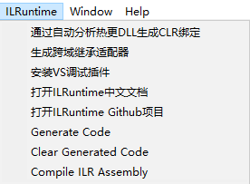

# ILRuntime 扩展

> 链接

**ILRuntime**： [中文文档](https://ourpalm.github.io/ILRuntime/) [仓库](https://github.com/Ourpalm/ILRuntime) [Unity样例仓库](https://github.com/Ourpalm/ILRuntimeU3D)

该扩展包仅支持 `ILRuntime(com.ourpalm.ilruntime)` 

## 配置


- IDE

  VS 的安装目录，系统添加 `ILRuntime_ScriptEditor` 环境变量，环境变量修改后需要退出 `Unity Hub` 才生效，区分编辑器 ILR 使用 VS2019，Unity 工程使用其它编辑器 VS2022 或 Rider

- Project File

  `ILRuntime` `.sln` 工程文件路径

- Assembly Name

  程序集名称，多个用 `|` 分隔，也可以点击 `Refresh` 按钮读取工程文件获取程序集名称

- Generate Code Path

  `Generate Code` 菜单生成的静态代码目录
  
- StreamingAssets Path

  默认：`ILR`，`ILR` 程序集相对 `StreamingAssets` 目录的路径，`ILRSettings.StreamingAssetsPath` 获取

  配置VS工程属性 `生成事件/生成后事件命令行`

  ```bash
  Copy /Y "$(TargetPath)" "$(SolutionDir)\..\..\..\..\StreamingAssets\ILR\$(TargetFileName)"
  Copy /Y "$(TargetDir)\$(TargetName).pdb" "$(SolutionDir)\..\..\..\..\StreamingAssets\ILR\$(TargetName).pdb"
  ```

- Auto Compile Assemblies

  默认为勾选，自动编译工程，当 `Unity` 编辑器从后台切换到前台时，源代码如果有改变则进行编译 `ILR` 工程

## 菜单



- Generate Code

  生成跨域调用的代码

- Clear Generated Code

  删除生成的代码

- Compile ILR Assembly

  编译 `ILR` 工程，需要配置工程路径

## 打开 ILR 工程

资源右键菜单添加 `Open ILR Project`，快捷打开 `VS` 工程


## 使用委托调用 ILR 方法

简化 `ILR` 方法

```c#
//--- ILR ---
public int Add(int a,int b)
{
	return a + b;
}

//--- CLR ---
var addFunc = appdomain.CreateDelegate<Func<int, int, int>>(obj, type.GetMethod("Add", 2));
addFunc(1, 2)
//result: 3
```

**生成步骤**

1. 生成 Delegate 代码

使用 `CLRCallILRAttribute` 声明要生成的委托

- 属性注册

```c#
[CLRCallILR]
public static List<Type> Types
{
    get
    {
        List<Type> list = new List<Type>();
        list.Add(typeof(Func<int, int, int>));
        return list;
    }
}
```

- 方法注册


```c#
[CLRCallILR]
public static IEnumerable<Type> GetTypes()
{
    yield return typeof(Func<int, int, int>);
}
```

- 委托注册

```c#
[CLRCallILR]
public delegate int AddDelegate(int a, int b);
```


2. 点击菜单 `ILRuntime/Generate Code` 生成，代码在 `Delegates.cs`

```c#
//Auto Generated
[CLRCallILRImplementAttribute]
static global::System.Func<int, int, int> Gen_Invoke_ILR_Delegate_0(AppDomain appDomain, object obj, IMethod method)
{
    return (arg0, arg1) =>
    {
        int result;
        using (var ctx = appDomain.BeginInvoke(method))
        {
            if (method.HasThis)
                ctx.PushObject(obj);
            ctx.PushInteger(arg0);
            ctx.PushInteger(arg1);
            ctx.Invoke();
            result = ctx.ReadInteger();
        }
        return result;
    };
}
```

